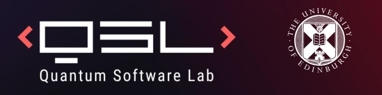

# Quantum-enhanced Markov Chain Monte Carlo Simulator

[](https://www.python.org/downloads/release/python-3130/)
[](https://quantum.cloud.ibm.com/docs/en/api/qiskit/release-notes/2.2)
[](https://docs.pennylane.ai/en/stable/)
[](https://opensource.org/licenses/MIT)

This is a lightweight research package for **Quantum-enhanced Markov Chain Monte Carlo** (QeMCMC) sampling over discrete spin/bitstring configurations.  

Link to GitHub repo: https://github.com/Stuartferguson00/QeMCMC


The implementation is inspired by the numerics in [_Layden et al's_ paper on QeMCMC](https://www.nature.com/articles/s41586-023-06095-4) and builds upon the foundations of the [pafloxy/quMCMC](https://github.com/pafloxy/quMCMC) repository.

## Documentation
Documentation and examples can be found [here](https://stuartferguson00.github.io/QeMCMC).

## Features
- **Arbitrary Energy Models:** Define any classical Ising or QUBO-like model using a simple list of coupling tensors (example: 2D Ising `h`, `J` etc). A universal energy calculator handles arbitrary-order interactions
- **Hamiltonian Evolution:** Build the corresponding **quantum Hamiltonian** based on the given couplings and run **Trotterised time evolution** with PennyLane's lightning qubit simulator
- **Coarse Graining**: Optionally use local updates on chosen subgroups of spins to scale proposals
- **Constraining**: Implementation of hard and soft constraints for a given model

## Installation

Install the latest release from [PyPI](https://pypi.org/project/qemcmc/) (requires Python 3.13+):

```bash
pip install qemcmc
```

### From source

The example notebooks live in this repo, not the published package. To run them or to develop QeMCMC, clone the repo and install with [`uv`](https://astral.sh/uv):

```bash
cd QeMCMC
uv sync
```

`uv sync` creates a local environment `.venv` and installs the locked dependencies from `pyproject.toml` and `uv.lock`.

## License

Distributed under the MIT License. See `LICENSE` for more information.

## Authors

This project was created and maintained by _Stuart Ferguson_ & _Feroz Hassan_.

For questions, suggestions, or collaboration, please feel free to contact the authors:

-   S.A.Ferguson-3@sms.ed.ac.uk.
-   fhassan2@ed.ac.uk

## Acknowledgements

-   [pafloxy/quMCMC](https://github.com/pafloxy/quMCMC) for the foundational code.
-   [Quantum-enhanced Markov Chain Monte Carlo](https://www.nature.com/articles/s41586-023-06095-4) by _David Layden et al._
-   [Quantum-enhanced MCMC for systems larger than your Quantum Computer](https://arxiv.org/abs/2405.04247) by _S. Ferguson and P. Wallden._

---
